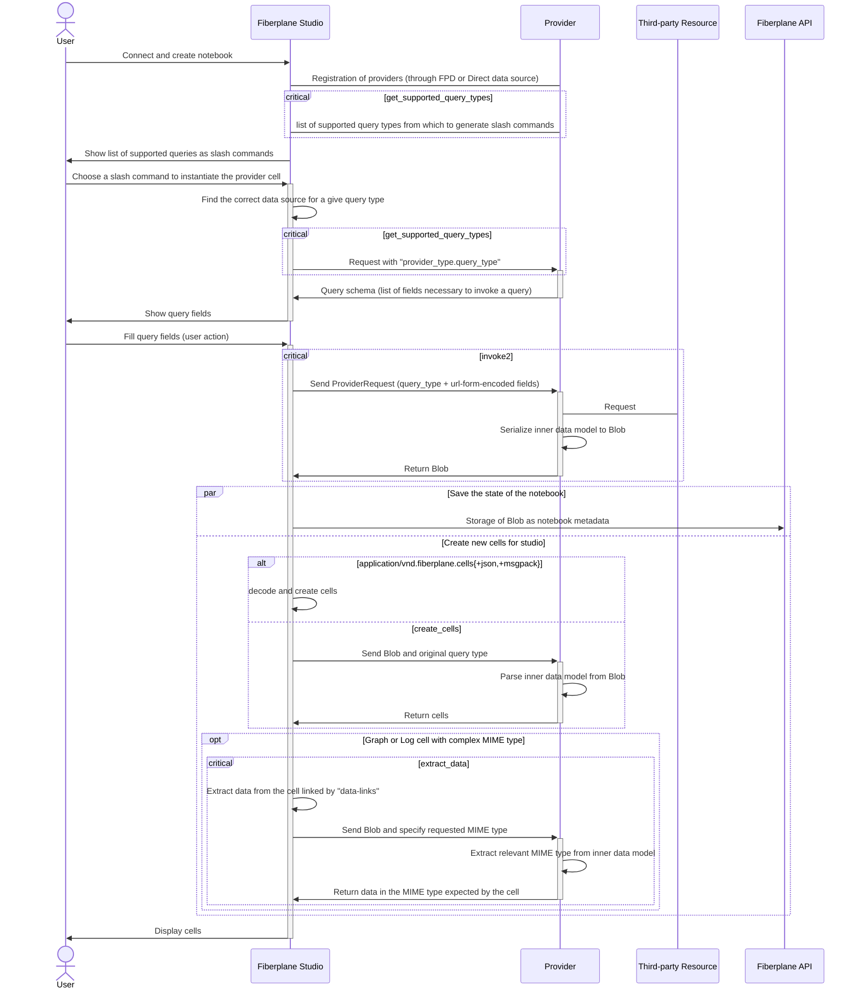

This page explains how the interactions between Fiberplane Studio and a provider happen to interactively add cells to a notebook. If you want to know how to write a provider, please refer to the [tutorial](doc:create-a-provider).

You should know what a notebook and cells are in Fiberplane context.

In the following page, a few words are important to define:

- **Third Party Resource**: the external resource from which to fetch data. For example, for the Prometheus provider, the third-party resource is the actual instance of Prometheus.
- **Data Source**: a data source is a configuration that specifies which third-party resource a provider should connect to. For example, you can configure 2 Prometheus data sources with the Prometheus Provider, each talking to a different instance.
- **Slash command**: a command that is presented after typing `/` in a notebook.
- **Blob**, **ProviderRequest**: data types from the [provider protocol](doc:provider-protocol-reference)
- **Provider Cell**: a special type of notebook cell, that is configured to execute queries using a specific provider.

## Summary sequence diagram

In the sequence diagram below, all "critical" sections are named after one of the functions of the
[provider protocol](doc:provider-protocol-reference).

## Adding data sources

Before Studio can allow users to run actions connected to a third party resource, it needs to know about the available data sources. There are 2 ways a provider can get registered to create data sources.

### Built-in Fiberplane providers

When Fiberplane builds and adds a provider integration first hand, we bundle those providers with Studio so that it will know about it in any cases. This allows users to configure direct data sources for these providers, as explained in the [Adding a data source](doc:quickstart) tutorial.

### Custom providers (through Fiberplane Daemon)

Fiberplane also allows you to use your custom providers in your workspace, using Fiberplane Daemon.
FPD will proxy the communication between your own WebAssembly provider and Fiberplane Studio. During start-up, FPD will automatically tell Fiberplane Studio about the data sources that are configured within the `data_sources.yaml` configuration file.

## Lifecycle of data source interaction

### Listing and choosing associated slash command

Once a data source is added to a notebook, Fiberplane Studio will call `get_supported_query_types` to determine all the different types of queries that the provider supports for that data source. This function returns a list of queries with their names, and the input schema of the query (the list of field names and types to make a valid query).

When the user uses the slash command to create a provider cell for a given query type, Studio expands the input schema into a form with input fields. When the form is submitted, it invokes the provider.

### Invoking the provider and Showing results

Once the form in a provider cell is filled in, any user can "Run" the cell in order to invoke the provider and let it do its magic. When the user hits "Run", Studio serializes the fields into a `ProviderRequest` and uses that to call the `invoke2` function of the provider to retrieve its results.

#### Providers return Blobs

Providers respond to an invocation with a [`Blob`](https://docs.rs/fiberplane-models/latest/fiberplane_models/blobs/struct.Blob.html) that may contain an arbitrary MIME type. In many cases, that MIME type will be unknown to Studio, so additional interactions between Studio and the provider need to happen for Studio to make sense of the response. But a few MIME types are special, because Studio already knows exactly how to render those blobs in a notebook. In particular, `application/vnd.fiberplane.cells` represents an array of [Cells](https://docs.rs/fiberplane-models/latest/fiberplane_models/notebooks/enum.Cell.html) that will be immediately rendered by Studio.

#### Studio asks how to create cells

When the returned Blob contains any other MIME type (e.g. `application/vnd.fiberplane.providers.cloudwatch.query-results`), Studio needs to perform an additional call to know how to display the results in the notebook.

In that case, Studio will call `create_cells` on the provider, sending back the Blob it received. The provider can then use the `query_type` information as well as the Blob in order to return a list of Cells that Studio can render.

#### The case of data-heavy cells (data extraction)

Most [Cell](https://docs.rs/fiberplane-models/latest/fiberplane_models/notebooks/enum.Cell.html) types own their underlying data. For example, a `TextCell` structure will embed the actual text that should be displayed within it.

A few cell types do _not_ own their underlying data, mostly to avoid sending back and forth huge payloads to describe the cells. Currently the main cells that do not own their data are the [Log Cell](https://docs.rs/fiberplane-models/latest/fiberplane_models/notebooks/struct.LogCell.html) and the [Graph Cell](https://docs.rs/fiberplane-models/latest/fiberplane_models/notebooks/struct.GraphCell.html). Instead of having an array of events or an array of timeseries within, they use a property called `data-links` to describe where Studio should find the relevant data for the cell.

If you are building a custom provider that uses one of those cell types, you will want to use `cell-data:<mime-type>,self` as location of the underlying data, which tells Studio that the data in with the given MIME type can be found in the cell with ID `self`, which is a special way of identifying the provider cell for which the cells were created.

As for the actual MIME types to use, `application/vnd.fiberplane.events` is used for events to be rendered in Log cells, while `application/vnd.fiberplane.timeseries` is used for Graph cells. Whenever the data returned from the invocation does not match that specific format (it may be a provider-specific MIME type like `application/vnd.fiberplane.providers.cloudwatch.query-results`), Studio will call `extract_data` to extract the data in the format that it expects from the blob with a format it doesn't know about.

**Summary:**

When Studio wants to display a cell that uses `data-links` to locate its data, Studio will:

- read the MIME type to extract from the data-link (usually `application/vnd.fiberplane.events` or `application/vnd.fiberplane.timeseries`),
- determine the location of the cell to extract data from (usually `self`), and
- take the response blob from the provider cell and call the provider's `extract_data` function with both the blob and the requested MIME type

### Results in notebook

Once Studio did all the calls to obtain both the cells and their data, the information is stored in the notebook and synchronized with the Fiberplane API, from where it gets shared to all users so that everyone can look at and interact with the same data!
