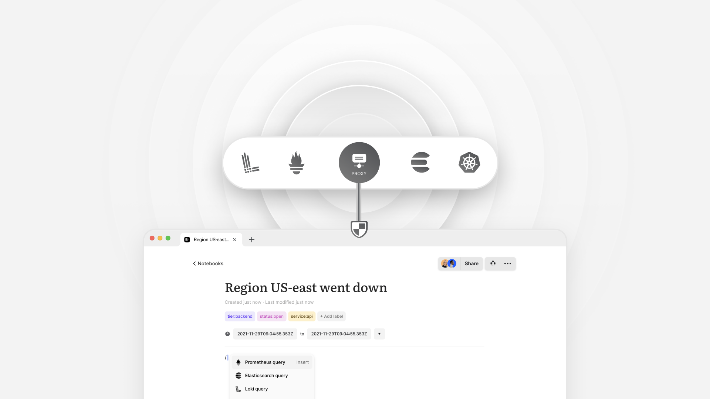
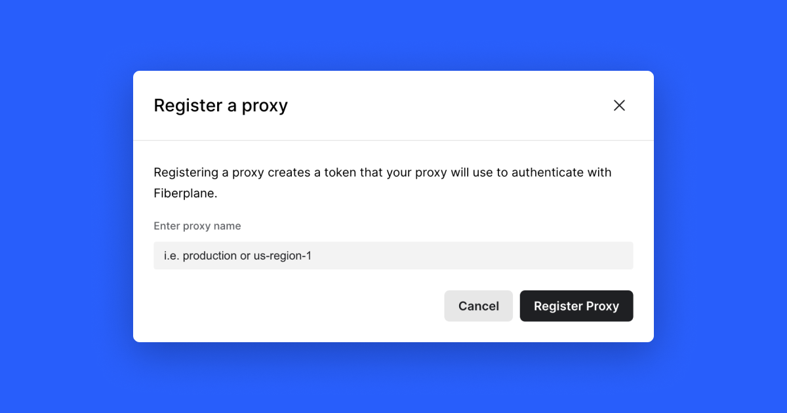

Fiberplane Studio is available for the [Web](https://fiberplane.com/).

To get started go to [https://fiberplane.com/](https://fiberplane.com/) and log
in with your Fiberplane account (currently available only for Google Workspace
users). You can also go right away to your notebook by typing
[fp.new](https://fp.new/) in your URL, however, to save and store your notebook,
you will need to log in.



## How Fiberplane works

Fiberplane Studio allows you to query, visualize, and understand metrics and
logs in your infrastructure.

Whenever you execute a query in the notebook:

1. The query is forwarded to the Fiberplane Proxy in your cluster;
2. The Proxy then queries the Provider data source (e.g. your Prometheus or
	 Elastic instance);
3. When the Provider returns the data, the Proxy processes, encrypts, and then
	 returns it back to the Studio.

# Set up the Fiberplane Proxy

The Fiberplane Proxy is a package that runs in your infrastructure. It enables
you to connect the Fiberplane Studio to data sources in your cluster(s) securely
without exposing them to the Internet.

The Fiberplane Proxy is available as a [container on Docker
Hub](https://hub.docker.com/r/fiberplane/proxy).

---

In order for the Proxy to receive queries from Fiberplane Notebooks, it needs to
be authorized. This step will generate a **Proxy API Token** that will be needed
in later steps.

You can do it in the Settings > Proxies menu or using our CLI tool.

## Generate a Proxy API Token in the Studio



In order for the Proxy to talk to the Fiberplane Studio successfully it needs to
be successfully authorized. This step will generate a **Proxy API Token** that
will be needed later.

1. Go to your Fiberplane [Settings page](https://fiberplane.com/settings).
2. Click **`+ New Proxy`** to register a proxy with a name that identifies the
	 cluster you will install it into (for example, "Production"). This will
	 generate and display a Proxy API Token that the proxy will use to
	 authenticate with the Fiberplane Studio.
3. Copy the Proxy API Token generated in Step 2 for the next step.

## Generate a Proxy API Token using the CLI

Download and install the Fiberplane CLI

```shell
curl --proto '=https' --tlsv1.2 -sSf https://fp.dev/install.sh | sh
```

Or download the Fiberplane CLI manually (make sure to make it executable):

- [Linux X86](https://fp.dev/fp/latest/x86_64-unknown-linux-gnu/fp)
- [MacOS Arm64](https://fp.dev/fp/latest/aarch64-apple-darwin/fp)
- [MacOS X86](https://fp.dev/fp/latest/x86_64-apple-darwin/fp)

Authenticate your CLI with Fiberplane

```shell
fp login
```

To register a proxy run a command `fp proxies create`:

```shell
$ fp proxies create my-proxy-name
				Name:  my-proxy-name
          ID:  <generated_proxy_id>
      Status:  disconnected
 Datasources:  (none)
        Token  <YOUR_PROXY_API_TOKEN> <-- SAVE THIS FOR LATER!
```

You can leave out the proxy name to have one randomly generated, but we
recommend naming it according to the environment it will be deployed to (for
example, `production`). Note that proxy names must follow the [Fiberplane name
format](doc:configuration-help-faq#resource-names).

# Next steps

You can now:

- add Providers;
- deploy the Proxy to Kubernetes cluster, Docker container or run it locally for
	testing.

## Add Providers

[Setting up Providers](doc:providers)

## Deploy

[Deploy to Kubernetes](doc:deploy-to-kubernetes)

[Deploy to Docker](doc:depoy-to-docker)

[Run Local](doc:run-local)

---

[Configuration help / FAQ](doc:configuration-help-faq)
