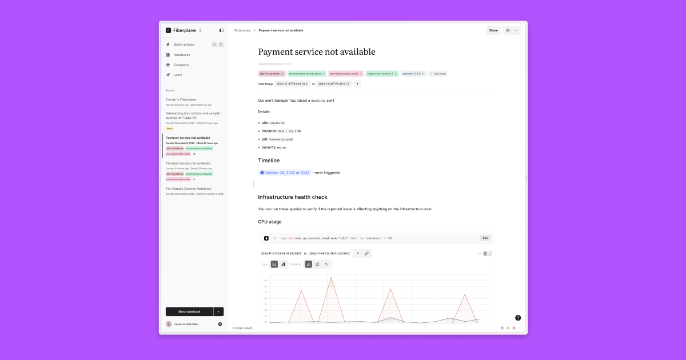
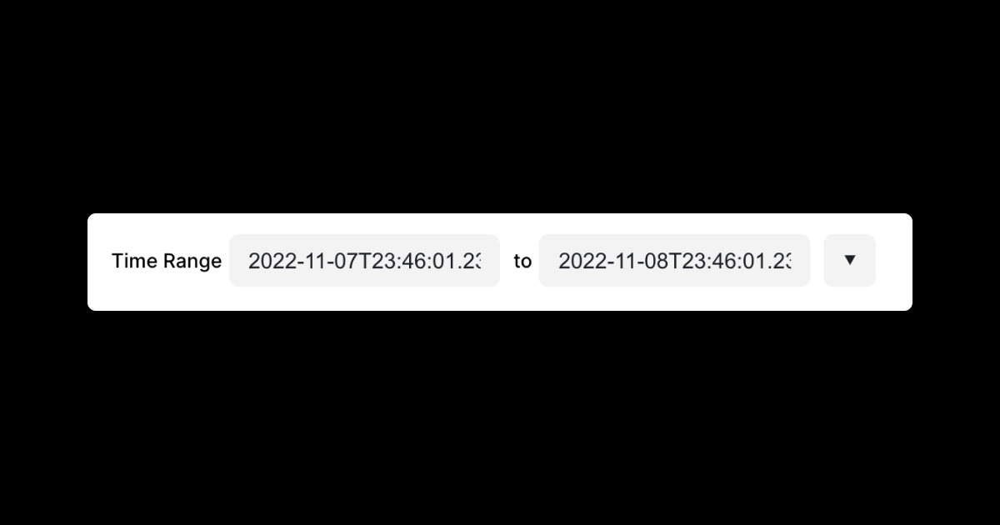
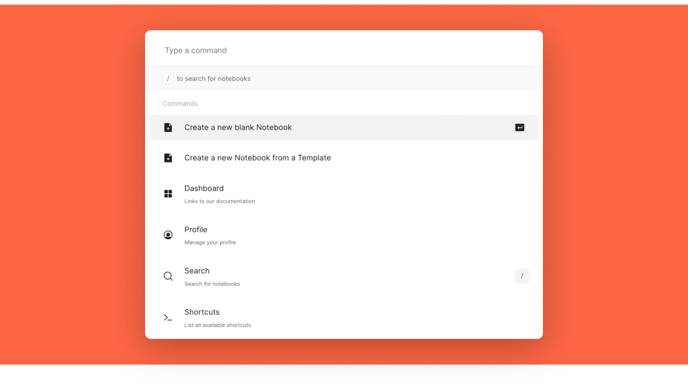
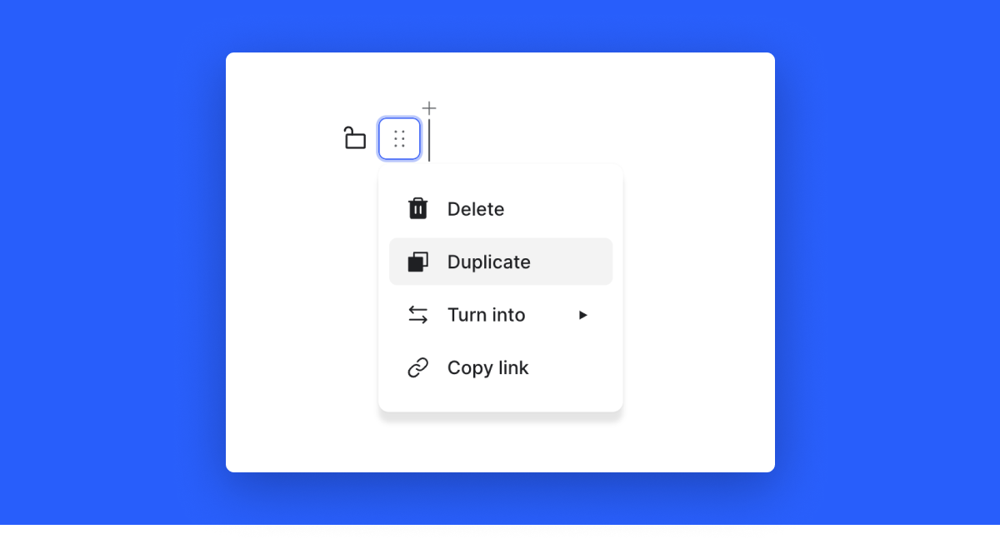

# Notebooks

Notebooks – collaborative spaces for your team – are at the core of Fiberplane.

Like Jupyter notebooks or other modern block-based editors, Notebooks in Fiberplane are made up of cells.



---

## Time range

The Notebook time range provides the ability to align all data source queries on the same start and end date. This way your data is aligned by default.
Changing the start or end date of the time range will rerun the linked queries in the notebook automatically.



## Labels

Labels help you categorize and organize your notebooks. They can be added as simple tags or key-value pairs following the [Kubernetes labels convention](https://kubernetes.io/docs/concepts/overview/working-with-objects/common-labels/).

Click `Add Label +`  to add a label, add a key-value pair separating it with `=` delimiter.

## Command menu

Anywhere in Fiberplane you can hit `⌘P`  (`CTRL-P` in Windows and Linux) to bring up the command menu. Command menu allows you to search for notebooks quickly (also using labels to filter them), navigate to sections in the app or execute actions quickly.



## Cells

Everything you write in a notebook is a **cell**. A cell can contain text (in its various rich formats), code snippets, images or provider queries and charts.


 With the controls in the left margin you can delete, duplicate, lock, change cell types or move them around by dragging them.



## Rich text

Most cells have the ability to display rich text in them. You can **bold**, *italicize*, highlight,  ~~strikethrough~~ content or insert `in-line code` and [links](https://www.notion.so/fiberplane/docs.fiberplane.com).
Cells include rich markdown support so you can type all of the above characters using their respective syntax:

| *bold* | Bold |
| --- | --- |
| _italic_ | Italic |
| `code` | Code (monotype) |

Besides these basic rich text editing features, Fiberplane also includes a number of further enhancements to help you distinguish your content.

### Mentions

You can `@mention` your team members in the notebook. Hit `@` , start typing the name, and select from the autocomplete list. The mentioned team member will get a notification, and the mention itself will show a different state depending if the mentioned person is online in the notebook or away.

### Timestamps

Timestamps allow you to insert datetime snippets easily and make them stand out in the notebook. Hit `@`  and select "timestamp" from the autocomplete menu.

## Slash `/` menu

Anywhere in a Notebook you can use the slash menu to bring up the cell type selector. Once selected it will create a new cell on the selected type (or if it's the first item, convert the cell in place).


## Cell types

### Headings, lists

To create headings use `#, ##, ###` symbols.
To create a numbered list type a number followed by `.` or `)`
To create a bullet list type a `-` or `*`.

### Checkbox

To add a checkbox use the `/` menu and use the autocomplete menu to select the "checkbox".

### Image cells

To add an image hit `/` and select "Image" format type. You can also simply drag and drop an image on a cell to add it or paste it directly into the notebook.

### Code cells

To add a code cell, hit `/` and select "Code" format type or type three backticks in a cell `````

### Discussion cells

Discussion cells allow you to have quick exchanges with your colleagues in the Notebook in the context of the rest of the data. They take place in the form of threads - each new cell discussion type starts a new thread.

To add a discussion cell, hit `/` and select "Discussion" format type.

Once a discussion is created it is marked as "Open". You can resolve and close the thread: this removes the ability to add further comments to it.

Comments can be edited or removed by the author by clicking the three dots on the right-hand side.


### Provider cells

Provider cells include cells for querying various data sources. Depending on what you have configured these can be e.g. Prometheus metrics, Elasticsearch or other.

Currently available Providers:

[Prometheus](./providers/Prometheus.md) 

[Elasticsearch](./providers/Elasticsearch.md) 

[Grafana Loki](./providers/Grafana Loki.md)
