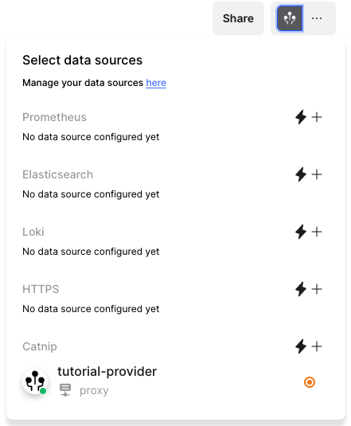

# Create a provider

This tutorial aims to help you create and modify your first provider. It will
not touch "advanced" cell types like the graph and the log cells, but will help
you integrate a third-party resource so that any output from it can be added to
a notebook with only a `/` command (we call those "slash commands").

This tutorial focuses on writing the provider in Rust, to be able to use the
convenience macros from Fiberplane Plugin Development Kit (PDK).
Provider Development Kits for other languages are coming later.

## Prepare the relevant resources

### Install Rust and the Web Assembly tools

The necessary tools to install to work with Fiberplane Plugin Development Kit are:

#### Rustup

[Rustup](https://rustup.rs/), the Rust toolchain handler. Follow the tutorial
to install Rust on your machine.

#### WebAssembly compilation target

Add the wasm32-unknown-unknown "target" with `rustup target add wasm32-unknown-unknown`.

#### WebAssembly optimizers

Install wasm-opt to optimize your plugins before they reach production. Wasm-opt
is part of [binaryen tools](https://github.com/WebAssembly/binaryen). The best
way to install this is to

- Go to the [releases page](https://github.com/WebAssembly/binaryen/releases)
and then download the tarball for the latest release (version 111 as of the 
day of writing). I am showing it in command line:
```console
$ wget https://github.com/WebAssembly/binaryen/releases/download/version_111/binaryen-version_111-arm64-macos.tar.gz
<some output>
$ ls -la
.rw-r--r--@ 5.1M you 22 Nov  2022 binaryen-version_111-arm64-macos.tar.gz
```
- Decompress the tarball in a directory on your machine.
```console
$ tar -xzf binaryen-version_111-arm64-macos.tar.gz
$ ls binaryen-version_111/
bin  include  lib
```
- Add the `bin` subdirectory of the tarball to your path. In the example below,
we assume that the tarball has been decompressed in `/Users/you/opt`
```sh
# In your shell rc file (.bashrc, .zshrc, .config/fish/config.fish....)
export PATH="/Users/you/opt/binaryen-version_111/bin:${PATH}"
```

#### Checkpoint

Start a new terminal to make sure that all your environment variables are
properly "refreshed", and then make sure that you have all the correct tooling
for the rest of the tutorial:

```console
$ which cargo
/Users/you/.cargo/bin/cargo
```
If you don't have `cargo`, you probably missed something in the Rust
installation step in [Rustup](https://rustup.rs).

```console
$ rustup target list --installed
aarch64-apple-darwin
wasm32-unknown-unknown
```
The `aarch64-apple-darwin` is the native target of my machine (Apple Silicon on
MacOS), the important part is to make sure that you have
`wasm32-unknown-unknown` target. If you don't have it, add the target with
`rustup target add wasm32-unknown-unknown`

```console
$ which wasm-opt
/Users/you/opt/binaryen-version_111/bin/wasm-opt
```

### Find the documentation of the external resource

For this tutorial we will integrate the [placeholder API](https://jsonplaceholder.typicode.com/)
with Fiberplane. Therefore we need to
find the relevant documentation for it, and decide on the necessary
configuration values we want to have in the provider.

#### Deciding on the features we can have and want to have

We'll assume that this API is actually a catnip dispenser API, so we want to know which
`User` entity is the closest to a given location given as `(latitude, longitude)` pair.

Each small scenario like that will make a _query_ in the provider.

#### Deciding on configuration schema for the provider

Since this API can be hosted on different locations, we want to have the endpoint of the API as
a configuration value for the provider. That means we only need to set this URL once, and no
user will have to worry about it again.

Good candidates for provider configuration values are like this:
- Little or no purpose to be changed on a call-by-call basis, but
- Still necessary for the provider to function correctly

By that criterion, authentication values are very good configuration values. Our API does not
handle authentication though, so we won't need it here.

#### Testing a SDK for serverless WebAssembly compilation

Sometimes the third party resource you want to integrate provides a Rust SDK.
But beware! There are a few libraries that will fail (either at compile time or
at run time) when compiled for serverless WASM. So if you are not sure that the
SDK will work with serverless wasm, it is better to find a classic API (on top
of HTTP or WebSocket protocols) documentation to communicate with the third
party resource. We will cover "finding out if the SDK works in serverless wasm"
when setting up the project.

When things don't work as expected, you can ask for help or guidance online[^serverlesswasm].

[^serverlesswasm]: The space of serverless WebAssembly is still
    young and a lot of package maintainers can make the change or help you make the change to get a library to compile and
    run for WebAssembly. Sometimes it means finding out support is [already there](https://github.com/gyscos/zstd-rs/pull/139),
    sometimes it means [adding items to their roadmap](https://github.com/awslabs/aws-sdk-rust/discussions/679)

#### Checkpoint

At that point you must know
- what configuration values are necessary to communicate with the third party
  resource
- a documentation/reference to be able to programmatically communicate with said
  resources

### Clone the Providers repo

The current Fiberplane [providers repo](https://github.com/fiberplane/providers)
contains a "sample"
[provider](https://github.com/fiberplane/providers/tree/main/providers/sample)
that is a good base to make your provider from: our CI pipeline guarantees that
the sample provider is always up-to-date with our supporting libraries, so it is
the quickest way to obtain a starting template.

Clone the repository and keep the location of the sample provider somewhere handy:
```console
$ git clone https://github.com/fiberplane/providers
$ export SAMPLE_PROVIDER_PATH="$(pwd)/providers/providers/sample"
```

#### Checkpoint

If you never restart your terminal session again, we will have a valid path for
`${SAMPLE_PROVIDER_PATH}`. We will not use it for long, but the point is that
you should have a fresh copy of the Fiberplane/providers repository.


## Instantiate a Daemon and side-load your sample provider for use in Studio

### Create your new provider repo, and test sample compilation

It's time to create your provider repo. To avoid the usual generic names, we
will create a `catnip` provider.

```console
$ mkdir catnip_provider
$ cd catnip_provider
$ cp -r "${SAMPLE_PROVIDER_PATH}"/* .
$ git init .
```

Once the repo is created, use the Cargo configuration feature to make the
compiler default to Web Assembly compilation. Create a `.cargo` folder at the
root of your repository, and a `config.toml` file[^profilerelease] inside:

```toml
# In .cargo/config.toml
[build]
target = "wasm32-unknown-unknown"
```

[^profilerelease]: You can also add a few other flags if you want. At Fiberplane
    we add a few flags for building the providers using the least disk-space
    possible, you can see them in our
    [repository](https://github.com/fiberplane/providers/blob/main/providers/.cargo/config)
    
The last step to setup your replica of the sample provider is to own it by
editing the `cargo.toml` file to set the name of the library:

```toml
# In Cargo.toml
name = "catnip_provider"
# ... Also edit the other metadata fields as you see fit, no `workspace` related metadata must stay in that section
```

You will also need to update the `Cargo.toml` file to replace the "workspace"
dependencies with proper standalone ones:

```toml
# In Cargo.toml

# in [dependencies]
fiberplane-pdk = { version = "1.0.0" }
serde = { version = "1", features = ["derive"] }

# in [build-dependencies]
vergen = { version = "7.4.2", default-features = false, features = [
  "build",
  "git",
] }
```

Finally, ignore all `.wasm` files from the repository, to avoid accidentally pushing
the providers you will build:

```gitignore
# In .gitignore, add a line
*.wasm
```

> Important Note: from now on, you only stay in the directory of your provider repository.

#### Checkpoint

Try to compile your provider, make sure that it's targeting web assembly and
then optimize the given web assembly binary.

```console
## Change to the directory of your provider
$ cargo build && wasm-opt -Oz -c -o "./catnip.wasm" "target/wasm32-unknown-unknown/debug/catnip_provider.wasm"
```

**Compilation Error**

If you have a compilation error, and just copied the sample provider, make sure
that you pulled the lastest version of the sample provider:

```console
cd ${SAMPLE_PROVIDER_PATH}
git checkout main && git push
cd /path/to/catnip_provider
rm -rf .
mkdir -p .cargo && cp "${SAMPLE_PROVIDER_PATH}/../.cargo/config" .cargo/config.toml
cp -r "${SAMPLE_PROVIDER_PATH}"/* .
```

And try to compile again.
```console
$ cargo build
```

If it still fails, then it's an issue with our own provider development kit. Please file an issue
to the repo with the title "Sample Provider does not compile".

**Wasm optimization error**

If the `wasm-opt` operation fails, it can mostly fail for 2 reasons:
- `wasm-opt` is not in `PATH`. If so, check the setup step earlier and make sure
  to pass the checkpoint
- `target/wasm32-...` doesn't exist.
  + check that the name of the library crate matches the name of the wasm you're
    optimizing.
  + check that you have correctly created the `.cargo/config.toml` file that
    changes the default compilation target to `wasm32-unknown-unknown`.

### Install Fiberplane Daemon and setup the token to load the sample provider in the proxy

#### Install the Daemon
Install [Fiberplane Daemon](https://github.com/fiberplane/proxy) using cargo:

```console
cargo install --locked fpd
```

#### Create a token for the proxy in your personal workspace

Go to [Fiberplane Studio](https://studio.fiberplane.com), make sure you are
currently in your personal workspace in the top left corner after logging in.

Click the Settings cogs in the bottom left corner of the screen, and go to
the "Proxies" category.


There, you will be able to create a new "Proxy", which needs a name
(For example `tutorial-proxy`), and then you will get a token. **Do not lose it**!!


This token is a mandatory argument to run the Daemon on your machine, so that
it can connect to Fiberplane Studio. A good way to save it is to put it in
your environment, as the Daemon will look into the environment for the token
if not provided in the command line:

```console
$ export TOKEN="<token content>"
```

> **Note**: This is probably a good reason to rename the environment variable
for the token right? Something like `FPD_TOKEN`. Either case, for now it's
`TOKEN`

#### Add a `data_sources.yaml` file to configure the provider

You can use `fpd` to edit and create a sample `data_sources.yaml` file to
use your provider, in the current directory[^canonical]:

[^canonical]: Fiberplane Daemon is configured to look for the data_sources configuration
    in the current working directory, and then in a canonical absolute path, if the
    command-line flag is absent. For the tutorial we will just use the current directory,
    but the recommended absolute location is the path returned by `fpd config paths data-sources`

```console
$ touch data_sources.yaml
```

In the `data_sources.yaml` file you are now editing, add this content:
```yaml
- name: tutorial-provider
  description: Tutorial provider
  providerType: catnip
  config:
    endpoint: https://jsonplaceholder.typicode.com
    accept: true
    numRetries: 1
```


#### Checkpoint

Run the daemon on your machine, and make sure that it doesn't error out, or
output error logs about catnip not being loaded:

```sh
# Either use the `--token` flag, or the `TOKEN` environment variable
RUST_LOG=error fpd --token <TOKEN> --wasm-dir . | grep -i "catnip"
```

Wait 10 seconds: if the app didn't quit on its own, and no log appeared, you're all set!

You can quit (using `Control + C`), and restart without the extra filters in a
background process:
```sh
fpd --token <TOKEN> --wasm-dir .
```

### Checkpoint: test the Sample provider in Studio

With your Daemon running and connected to Studio, you can immediately test if
"side loading" the provider worked:

**Is the `tutorial` proxy active?**

Go to your Proxy settings page: make sure that the proxy you created is present
in the list, and reported as "online". If it does not report as "online" even
after 5 minutes, make sure that you copied the token correctly, and that
the `fpd` instance you ran before is still up and runs without errors.


When the proxy reports as online, you can expand the line to also check the
status of the provider.

**Is the "Catnip" data source available?**

Create a new, empty notebook in your workspace, and click the data sources icon in the
top right corner. There should be an entry in the `Catnip` category, called
`tutorial-provider`. Make sure it's there and active.

In the following screenshot, the category is `Sample`, it should be `Catnip` for
you:



**Is the slash Command present?**

Go in a cell of the notebook, and hit `/`. The menu should appear, and now you
can start typing `showcase`. You should see the 2 `Showcase` commands appear
in the menu.


**Is the Daemon communicating fine?**

Accept any of the "Showcase" command, input some text in the fields, and try to
run the Cell.


If you obtain a result in the notebook, congratulations! You've successfully side-loaded
a Web Assembly plugin to your Fiberplane workspace! This is (_was_) the hardest part of the
tutorial.

## Modify the sample provider to implement _your_ integration

In the following, we use "query" to describe one type of request that is handled
by the provider, including all the requests that make the slash commands in the
notebook later, but also the "built-in" requests used by Studio for extra
features such as health reporting and auto-suggestions.

### Implement your configuration type

Change the configuration from the sample to use the configuration you decided on
instead. For the `catnip_provider` the only configuration value is the base URL
of the API (so that configuring the provider will create either a production, or
a staging, data source for notebooks).

```rust
// Replace the SampleConfig type

#[derive(ConfigSchema, Deserialize, Serialize)]
struct CatnipConfig {
    #[pdk(label = "API endpoint", placeholder = "Please specify a URL")]
    pub endpoint: String,
}
```

### Implementing a new query

Let's make a query that prompts the notebook users for a latitude/longitude, and
return information about the closest user from
`https://jsonplaceholder.typicode.com/` API geographically. This is a little
convoluted, but the point is to show multiple things when creating your
provider.

Let's assume that all users from `https://jsonplaceholder.typicode.com/` are
catnip dispensers and we want to know where to go to get our fix.

Before piping all the logic between Studio and the Provider, we will implement
the query. This section is "vanilla Rust API development sprinkled with
serde_json and fiberplane-provided http client", so if you are experienced you
might want to read the section quickly/skip it.

#### Making an internal Data Model

First, we need to add `serde_json` as a dependency as we will be working with a JSON API

```toml
# In Cargo.toml
[dependencies]
serde_json = "1"
serde_aux = "4.1" # serde_aux provides helpers for JSON deserialization
```

Then we add the data types that match the API entries we want to work with, and build a data-model that's relevant for the query

```rust
use serde_aux::deserialize_number_from_string;

#[derive(Deserialize, Serialize, Debug, Clone)]
struct User {
    id: usize,
    name: String,
    username: String,
    email: String,
    address: Address,
    phone: String,
    webside: String,
    company: Company
}

#[derive(Deserialize, Serialize, Debug, Clone)]
struct Address {
    street: String,
    suite: String,
    city: String,
    zipcode: String,
    #[serde(rename = "geo")]
    geocode: GeoLocation
}

#[derive(Deserialize, Serialize, Debug, Clone, Copy)]
struct GeoLocation {
    #[serde(deserialize_with = "deserialize_number_from_string", rename = "lat")]
    latitude: f64,
    #[serde(deserialize_with = "deserialize_number_from_string", rename = "lon")]
    longitude: f64
}

#[derive(Deserialize, Serialize, Debug, Clone)]
#[serde(rename_all = camelCase)]
struct Company {
    name: String,
    catch_phrase: String,
    bs: String
}

#[test]
fn test_deserialization() {
let sample = r#"
{
    "id": 1,
    "name": "Leanne Graham",
    "username": "Bret",
    "email": "Sincere@april.biz",
    "address": {
      "street": "Kulas Light",
      "suite": "Apt. 556",
      "city": "Gwenborough",
      "zipcode": "92998-3874",
      "geo": {
        "lat": "-37.3159",
        "lng": "81.1496"
      }
    },
    "phone": "1-770-736-8031 x56442",
    "website": "hildegard.org",
    "company": {
      "name": "Romaguera-Crona",
      "catchPhrase": "Multi-layered client-server neural-net",
      "bs": "harness real-time e-markets"
    }
  }"#;
  
  let _ = serde_json::from_str::<User>(sample).unwrap();
}
```

With this data model, we can create a function that will return the closest user from a location

```rust
fn distance_between(origin: GeoLocation, destination: GeoLocation) -> f64 {
    ((destination.longitude - origin.longitude).powi(2) + (destination.latitude - origin.latitude).powi(2)).sqrt()
}

fn closest_user(target: GeoLocation, users: &[User]) -> Option<(f64, User)> {
    users
        .iter()
        .map(|user| (distance_between(user.geocode, target), user.clone()))
        .min_by(|(distance_l, _), (distance_r, _)| distance_l.cmp(distance_r))
}
```

Now we have all the internal logic from the provider to compute the relevant
data. We still need to fetch the users from the API.

#### Using Provider Bindings to implement behaviour

We cannot use an API client crate such as `reqwest` in providers[^wasmhost],
that is where we must use the provided methods from the provider bindings to
make the call. The function below is using the provided bindings to make a
query to the JSON placeholder API returning the list of users.

The pattern here is:
- build a `fiberplane_pdk::prelude::HttpRequest` structure
- call the `fiberplane_pdk::prelude::make_http_request` binding that will
  arrange for the runtime to make the call. This is the "reqwest" call
  equivalent in Fiberplane bindings
- extract all the relevant data from `fiberplane_pdk::prelude::HttpResponse`.

With proper error management, it is possible to return a `Result<Vec<User>>`
instead of trying to return a `Vec<User>` and panicking[^providerpanics] (panics crash the provider).

```rust
// The Result here is a `fiberplane_pdk::prelude::Result`
async fn fetch_users(config: &CatnipConfig) -> Result<Vec<User>> {
    let base_url: Url = config
        .endpoint
        .parse()
        .map_err( |e| Error::Config { message: format!("Invalid URL in configuration: {e:?}") })?;
    let url = base_url
        .join("/users")
        .map_err( |e| Error::Config { message: format!("Invalid URL in configuration: {e:?}") })?;

    let request = HttpRequest {
        url,
        headers: None,
        method: HttpRequestMethod::Get,
        body: None,
    };
    let response = make_http_request(request).await?;
    
    serde_json::from_slice(&response.body).map_err(|e| Error::Deserialization { message: format!("Could not deserialize payload: {e:?}") })
}
```

[^wasmhost]: In the WebAssembly computation model, the host runtime is responsible for
    managing the connection and OS resources to make the HTTP queries

[^providerpanics]: Provider panics make the provider crash. The concurrent queries being
    handled might also fail, and Studio won't be able to do clean error reporting if
    the provider just crashes instead of giving back a meaningful error message!
    
We now have all the building blocks to implement our query:

```rust
async fn fetch_closest_user(config: &CatnipConfig, target: GeoLocation) -> Result<Option<(f64, User)>> {
    let users = fetch_users(config).await?;
    Ok(closest_user(target, &users).cloned())
}
```
    
### Adding a new query

In the previous chapter, we implemented all the internal provider logic for the query we want to
add to notebooks. The missing part is how to connect this logic to a notebook:

- how to obtain the `CatnipConfig`, `(latitude, longitude)` from the users through Studio? 
- how to return meaningful values to Studio so that it shows the data in notebook cells?

#### Choosing a name for the query

The query name be used in the URL to encode the request type for the provider. Let's use
`x-closest-dispenser`. The `x-` prefix is mandatory[^whyx].

```rust
// Add a new constant in the library

pub const CLOSEST_DISPENSER_QUERY: &str = "x-closest-dispenser";
```

[^whyx]: The `x-` prefix ensures that there will never be collisions with built-in query
    types used by Studio, like the queries used to query the status of a provider,
    or completion suggestions.
    
    
#### Adding a query data model

The `QuerySchema` macro deals with creating a structure that will show matching
input fields in Studio. We create a `CatnipClosestQuery` structure that will
prompt the user for a latitude and a longitude when Studio expands a slash
command for this query:

```rust
#[derive(QuerySchema, Deserialize, Serialize, Debug, Clone)]
struct CatnipClosestQuery {
    #[pdk(label = "Latitude (must be a floating point number)", placeholder = "52.3740300")]
    pub latitude: String,

    #[pdk(label = "Longitude (must be a floating point number)", placeholder = "4.8896900")]
    pub longitude: String,
}
```

#### Implementing the handler when the provider is `invoke`d

The query data model, and the configuration data model, are the 2 things that
are needed to implement our handler for the query. For the time being we are
making the simplest handlers, that always return the same MIME type:
`CELLS_MIME_TYPE`, which is a builtin MIME type natively handled by Studio. As
long as we return a `fiberplane_pdk::prelude::Cells` that is transformed to a
`Blob` we won't need to implement anything else in the provider protocol[^actually].

[^actually]: This is not entirely true: Log cells and Graph cells need extra code to
    appear properly, but this is an advanced topic for another piece.
    

```rust
async fn find_closest_dispenser(query_data: CatnipClosestQuery, config: CatnipConfig) -> Result<Blob> {
    let response = fetch_closest_user(&config, GeoLocation { latitude: query_data.latitude, longitude: query_data.longitude }).await?;
    let cells = match response {
        None => {
            vec![Cell::Text(TextCell {
                id: "result".to_owned(),
                content: "No dispenser was found!".to_string(),
                formatting: Formatting::default(),
                read_only: None,
            })]
        },
        Ok((distance, dispenser)) => {
            vec![Cell::Text(TextCell {
                id: "result".to_owned(),
                content: format!("The closest dispenser to you ({query_data.latitude}, {query_data.longitude}) is\n{} ({})\n\t{} {}\n\t{} {}",
                    dispenser.name,
                    distance,
                    dispenser.address.street,
                    dispenser.address.suite,
                    dispenser.address.city,
                    dispenser.address.zipcode
                ),
                formatting: Formatting::default(),
                read_only: None,
            })]
        
        }
    };

    Cells(cells).to_blob()
}
```

#### Updating the `supported_query_types` list

In order to get your query to appear and be usable from Studio, the provider
needs to advertise it. It is done thanks to the `pdk_query_types!` macro, by
adding an extra query, associating the name with the data model and a handler
function.

```rust
// Remove all existing queries except the Status one, so the pdk_query_types! macro
// becomes
pdk_query_types! {
    CLOSEST_DISPENSER_QUERY => {
        label: "Catnip: find closest dispenser",
        handler: find_closest_dispenser(CatnipClosestQuery, CatnipConfig),
        supported_mime_types: [CELLS_MIME_TYPE]
    },
    STATUS_QUERY_TYPE => {
        handler: check_status(),
        supported_mime_types: [STATUS_MIME_TYPE]
    }
}
```

#### Checkpoint

You should be able to run the query from Studio now! To test it

- Open `studio.fiberplane.com` and switch to your personal workspace
- Add the data source for `catnip_provider` from the proxy to your workspace.
- Create a new notebook in your workspace
- Try typing `/catnip` in a cell, and select your `Catnip: find closest dispenser` action
- Fill the latitude and longitude, and run the query

The results should appear in a new cell in the notebook!

## Conclusion

Words, and link to [advanced page](doc:creating-a-provider-advanced)
