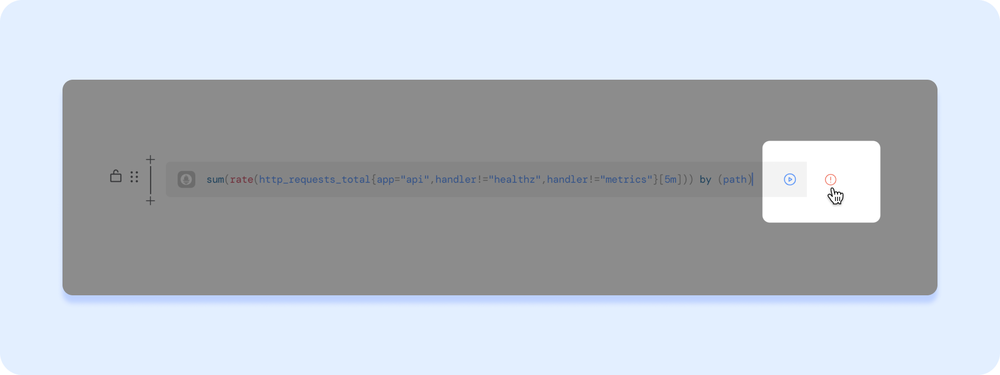

# Configuration help / FAQ

## Resource Names

Many resources in Fiberplane are identified by unique names. Names follow the string format of [Kubernetes label names](https://kubernetes.io/docs/concepts/overview/working-with-objects/names/#dns-label-names) / [RFC 1123](https://tools.ietf.org/html/rfc1123):

- contain at most 63 characters
- contain only lowercase alphanumeric characters or '-'
- start with an alphanumeric character
- end with an alphanumeric character

## Troubleshooting

### If you see a red exclamation mark after running a query:

- Click on the mark to reveal the console at the bottom of the window: it will reveal more about the error.
- Check if the syntax of the query is incorrect.
- Check if a data source you want to query is online and selected

### If Proxy is offline:

- Check that you have set the `PROXY_API_TOKEN` correctly in your `deployment.yaml` and passed it to the configuration.
- Check that you have configured the data sources. Proxy currently cannot be deployed if there are no data sources configured in the `configmap.yaml`.

### If Providers are offline:

- Check if the URLs on `configmap.yaml` are correct. Especially if you’re using custom ports for your providers (e.g.: running Prometheus on `:8041`)
- Check that the pod the Proxy is installed on has read permissions to access other pods with  Prometheus/Elasticsearch services you want it to access.
