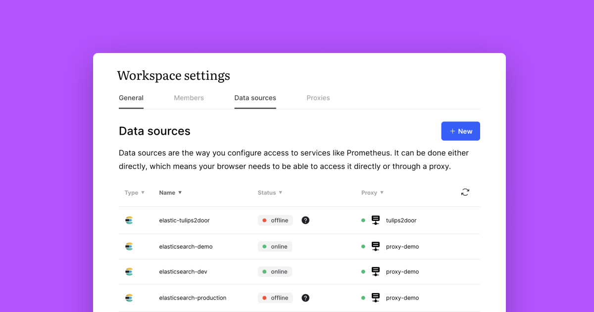

# Deploy to Docker

## Generate a Proxy API Token in the Studio

.png)

In order for the Proxy to talk to the Fiberplane Studio successfully it needs to be successfully authorized. This step will generate a **Proxy API Token** that will be needed later.

1. Go to your Fiberplane [Settings page](https://fiberplane.com/settings).
2. Click **`+ New Proxy`** to register a proxy with a name that identifies the cluster you will install it into (for example, "Production"). This will generate and display a Proxy API Token that the proxy will use to authenticate with the Fiberplane Studio.
3. Copy the Proxy API Token generated in Step 2 for the next step.

## Deploy using Docker

1. Make sure you have Docker installed: [https://docs.docker.com/get-docker/](https://docs.docker.com/get-docker/)
2. Create a `data_sources.yaml` in the current directory in the following format:

```yaml
# data_sources.yaml
#
# Replace the following line with the name of the data source
- name: prometheus-prod
  description: Prometheus (Production)
  providerType: prometheus
  config:
    # Replace the following line with your Prometheus URL
    url: http://prometheus
```

3. Run the following command replacing `<PROXY_API_TOKEN>` with the Proxy API Token created earlier:

```bash
docker run \
  -v "$PWD/data_sources.yaml:/app/data_sources.yaml" \
  fiberplane/proxy:v2 \
  --token=<PROXY_API_TOKEN>
```

Once you complete your Proxy setup, your data sources linked in the Proxy configuration should be recognized by the Studio - you can verify this again by going to the **Settings > Data Sources** screen.👇


