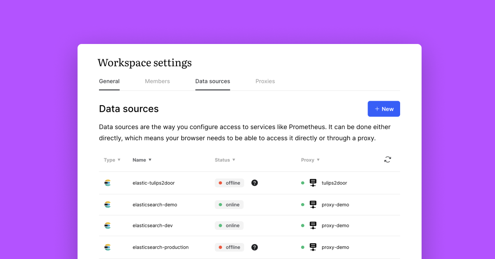

# Deploy to Kubernetes

## Generate a Proxy API Token in the Studio

.png)

In order for the Proxy to talk to the Fiberplane Studio successfully it needs to be successfully authorized. This step will generate a **Proxy API Token** that will be needed later.

1. Go to your Fiberplane [Settings page](https://fiberplane.com/settings).
2. Click **`+ New Proxy`** to register a proxy with a name that identifies the cluster you will install it into (for example, "Production"). This will generate and display a Proxy API Token that the proxy will use to authenticate with the Fiberplane Studio.
3. Copy the Proxy API Token generated in Step 2 for the next step.

## Deploy the Proxy to your Kubernetes cluster

1. Create the Kubernetes configuration file and change the Prometheus URL to point to the Prometheus instance(s) inside your cluster:

```yaml
# configmap.yaml

---
apiVersion: v1
kind: ConfigMap
metadata:
  name: fiberplane-proxy
data:
  data_sources.yaml: |
    # Change this file to point to your actual data source(s)

    # You can add data sources using this format:
    # Data Source Name:
    #   type: prometheus
    #   options:
    #     url: your prometheus URL

    # More data source types are coming soon!

    # The data source name will appear in the Fiberplane Studio
   - name: prometheus-prod
		 description: Prometheus (Production)
		 providerType: prometheus
		 config:
	     # Replace the following line with your Prometheus URL
	     url: http://prometheus
```

1. Create the Kubernetes deployment file (replace `<token>` with the Proxy API Token created during the earlier step):

```yaml
# deployment.yaml

---
apiVersion: apps/v1
kind: Deployment
metadata:
  name: fiberplane-proxy
  labels:
    app: fiberplane-proxy
spec:
  replicas: 1
  selector:
    matchLabels:
      app: fiberplane-proxy
  template:
    metadata:
      labels:
        app: fiberplane-proxy
    spec:
      containers:
      - name: fiberplane-proxy
        image: "fiberplane/proxy:v2"
        env:
          - name: TOKEN
            value: "<token>" # <-------------------------------- REPLACE ME
          - name: DATA_SOURCES_PATH
            value: /app/config/data_sources.yaml
          - name: RUST_LOG
            value: proxy=debug
        volumeMounts:
          - name: data-sources
            mountPath: /app/config/data_sources.yaml
            subPath: data_sources.yaml
      volumes:
        - name: data-sources
          configMap:
            # Provide the name of the ConfigMap containing the files you want
            # to add to the container
            name: fiberplane-proxy
            items:
              - key: data_sources.yaml
                path: data_sources.yaml
```

1. Apply the changes to your Kubernetes cluster by running the following commands:

```bash
kubectl apply -f configmap.yml
kubectl apply -f deployment.yml
```

Once you complete your Proxy setup, your data sources linked in the Proxy configuration should be recognized by the Studio - you can verify this again by going to the **Settings > Data Sources** screen.👇


