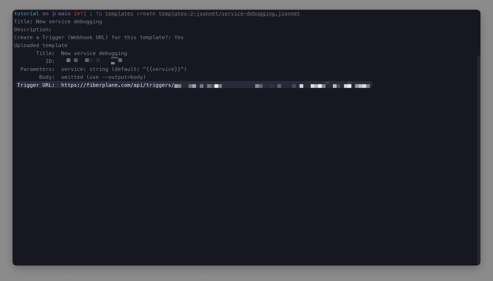
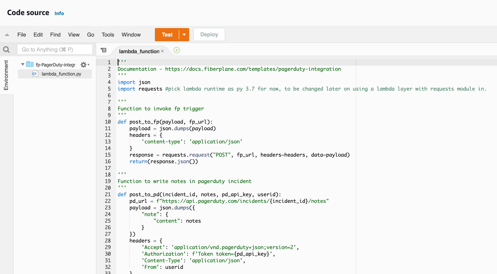
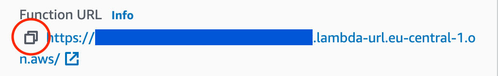
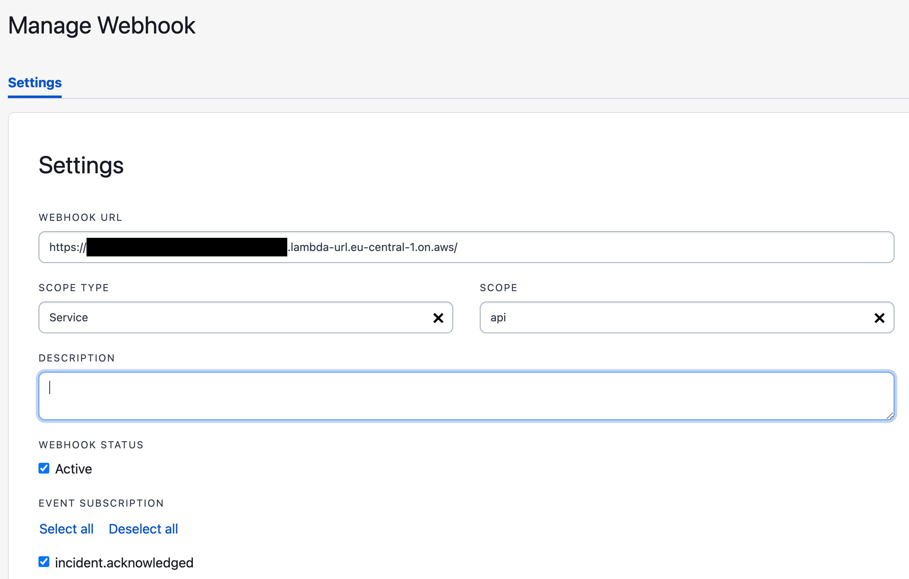
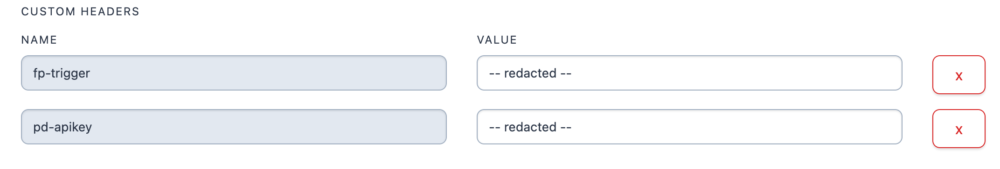
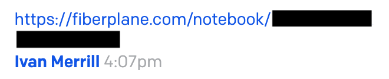
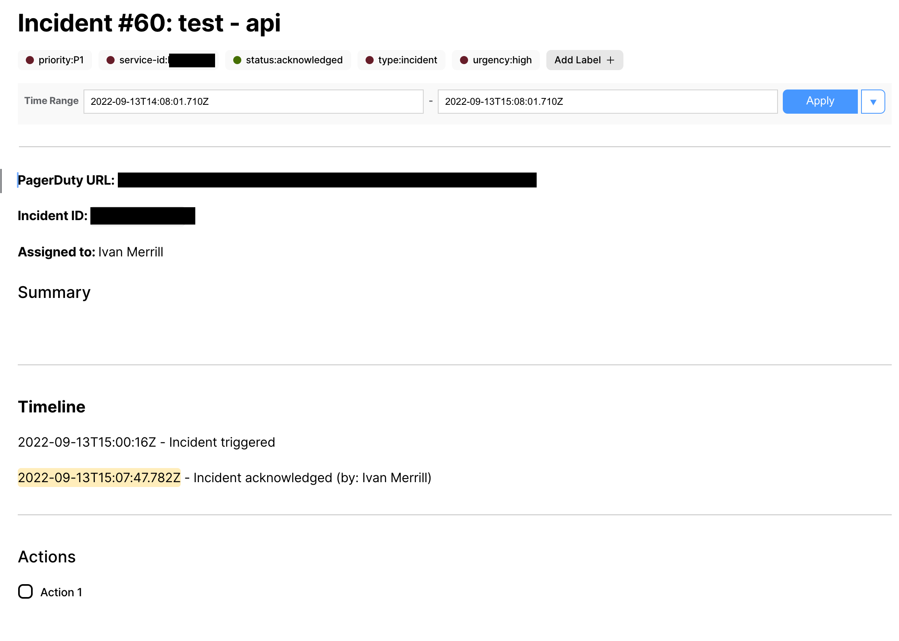

# PagerDuty Integration

- Create a Fiberplane notebook automatically when a PagerDuty incident is acknowledged.
- Use Fiberplane templates to start an incident investigation with everything you need.
- Update the PagerDuty incident with the Fiberplane notebook URL to click straight from the incident to the investigation.

## How it Works

- Once a PagerDuty incident is created or acknowledged, a trigger event will be sent to Fiberplane to create a new notebook based on the PagerDuty template.
- When the notebook has been created, the notebook URL will be sent to the PagerDuty incident and included as a note on the incident. This URL can then be clicked on taking the user straight to the Fiberplane notebook.
- The PagerDuty template uses information such as the service name, incident severity and name of the person acknowledging the incident to create a notebook that can be used to openly and collaboratively investigate an incident.

## Requirements

- A PagerDuty [General access REST API key](https://support.pagerduty.com/docs/api-access-keys#section-generate-a-general-access-rest-api-key) is required for this integration to send the notebook URL back to PagerDuty.
- Access to an AWS account is required to create a new lambda function.
- The Fiberplane CLI is required to create a new trigger endpoint for a template. Instructions to install the CLI and log into Fiberplane with it are [here](https://docs.fiberplane.com/cli).

## Support

If you need help with this integration, please contact ***[support@fiberplane.com](mailto:support@fiberplane.com)***.

## Guide

### In Fiberplane

1. Go to the **incident-response-pagerdutyV3** template found in the [Fiberplane Quickstart Repository](https://github.com/fiberplane/quickstart/tree/main/templates/incident-response-pagerdutyV3)
2. Follow the instructions to create a template and trigger using the CLI.
3. Note the **Trigger URL** for later use.
    

    

### In the AWS console

1. Navigate to the **Lambda** service.
2. Click the orange **Create function** button.
3. Name your function **fp-PagerDuty-integration** and select the **Python 3.7** runtime from the dropdown menu.
4. Click the **Advanced settings** drop down menu and select **Enable function URL** and choose **NONE** as the Auth type.
5. Press the orange **Create function** button.
6. In the **Code source** section double click the folder named **fp-PagerDuty-integration** and then double click **lambda_function.py** to open the file in the code editor.
7. In a separate browser tab open the **lambda_function.py** page in the PagerDuty integration section of the [Fiberplane Quickstart Repository](https://raw.githubusercontent.com/fiberplane/quickstart/main/integrations/PagerDuty/lambda_function.py) and copy all of the contents of the file.

1. Switch back to the AWS lambda console in your browser and paste the code into the **lambda_function.py** file in the **Code source** editor**.**
2. Press **File → Save** in the **Code source** editor. 
3. Press **Deploy.**
4. Copy the **Function URL** in the **Function Overview** section.

### In PagerDuty

1. Click on **Integrations** and then **Generic Webhooks (v3)**
2. Click on the **+ New Webhook** button.
3. In the **Webhook URL** section add the **Function URL** copied from the AWS lambda function.
4. Select **Service** as the **SCOPE TYPE**.
5. Select your service in the **SCOPE** dropdown menu.
6. Press **Deselect all** then check the top box listed **incident.acknowledged**.
7. Click **Add custom header**.
8. Type **fp-trigger** in the **name** field and add the Fiberplane trigger URL in the **value** field .
9. Click **Add custom header**.
10. Type **pd-apikey** in the **name** field and add your PagerDuty API key in the **value** field.
11. Click **Add Webhook** and then **OK**

## Testing the integration

1. Go to the I**ncidents** screen in PagerDuty and click **+ New Incident**
2. Select an **Impacted Service** and add a **Title** to the incident and optionally select an **Urgency, Incident Priority** and **Description.**
3. Click **Create Incident** 
4. Click **! Acknowledge**
5. Check that the notebook URL is updated in the incident notes:

1. Click on the URL and ensure that it takes you through to the notebook and the notebook is correctly filled out with the data:

## How to Uninstall

1. In PagerDuty click on **Integrations** and then **Generic Webhooks (v3)**
2. Click on the menu represented by **three dots** on the right of the webhook listing and press **delete**.
3. Open a terminal session, type **`fp login`** and press **enter**.
4. Type **`fp triggers list`** then press **enter**, find the trigger ****and **copy** the **ID** of the trigger.
5. Type **`fp triggers delete <trigger ID>`** and press **enter**.
6. Open the AWS lambda console and click on the lambda function **fp-PagerDuty-integration**
7. Click on the **Actions** menu in the top right and then **Delete function**
